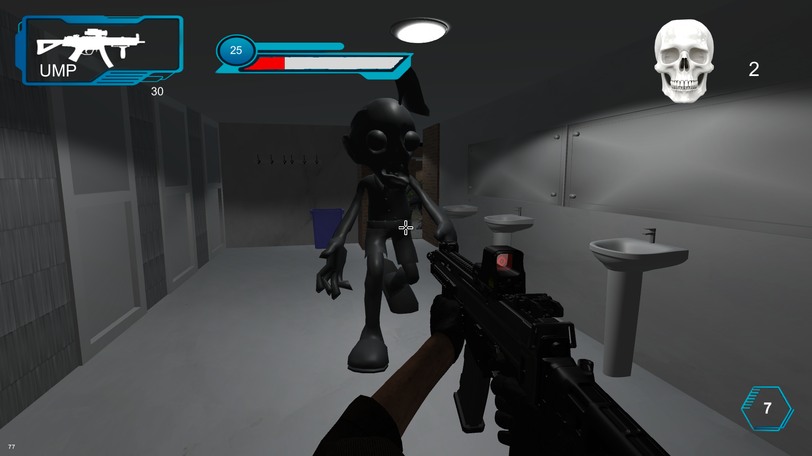
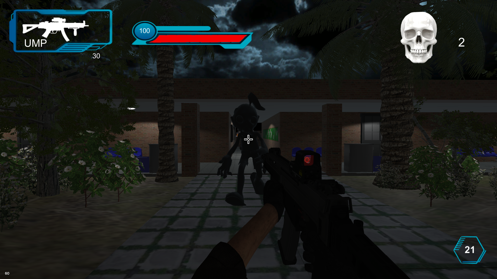
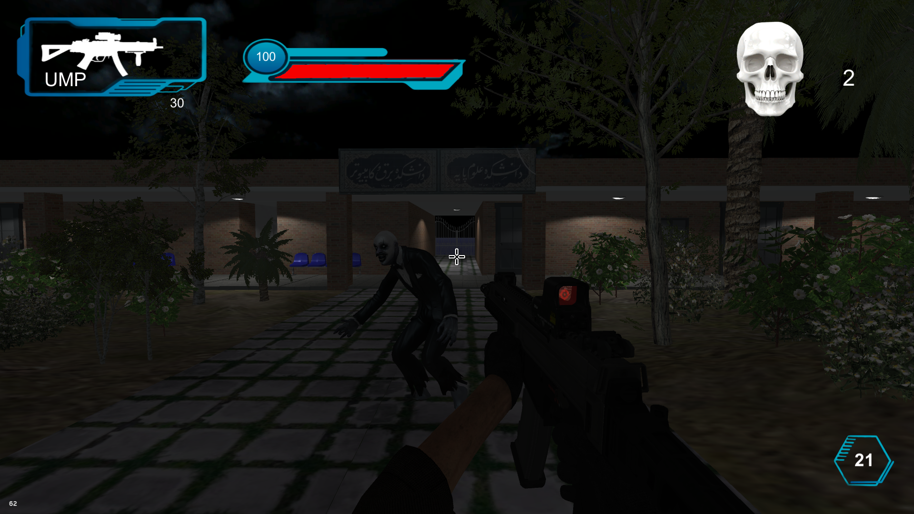
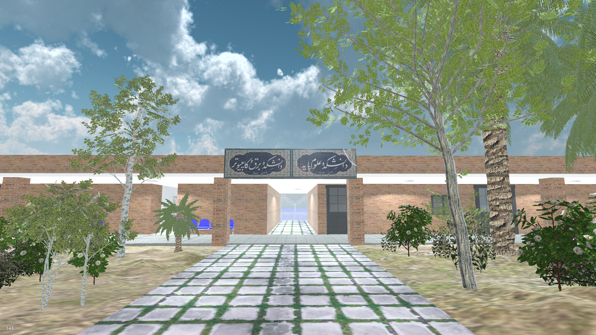

# QUT Zombie Game
It's a simulation of the busiest spot in Qom University of Technology in the Horror genre with original and funny zombie sounds(just for fun).
sorry for the UNCLEANLINESS of scripts, I do better now.

# Features
* Healthbar
* Kill counter
* Spaghetti code :(
* Original sounds
* Endless gameplay

# Description 

There are two modes to play:

### **1.Night mode**
A score-based mode; Player starts on the center of the map and zombies spawn from 3 places constantly. Player can move around and shoot zombies untill they are out of HP.

### **2.Day(Morning) mode**
No zombies. Player can roam the map in daylight and see the frozen zombie models.

# Real World Images
<table>
  <tr>
    <td></td>
    <td></td>
    <td></td>
  </tr>
  <tr>
    <td></td>
    <td></td>
    <td></td>
  </tr>
</table>

# The Whole Project?
Because of the huge size of the project, the scripts are committed only.
# How to Play
Here is the portable version:
https://drive.google.com/file/d/1RoRINkV1sP6FshsTb5bnbFuh4CoGYSz-/view?usp=drive_link
## License
This project is licensed under the [MIT License](LICENSE).
