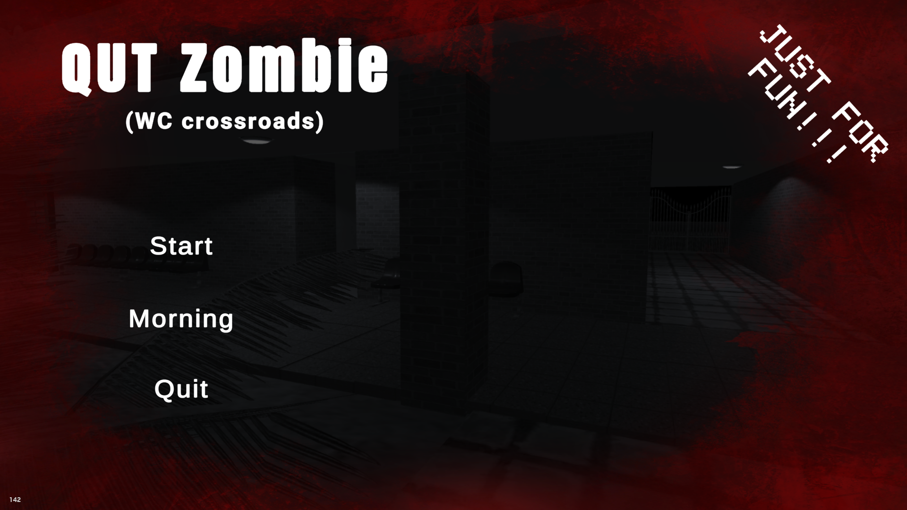

# QUT Zombie game
It's a simulation of the most busy spot in Qom University of Technology in the terror genre with original and funny zombie sounds(just for fun).
sorry for the UNCLEANLINESS of scripts, I do better now.
# Features
* Healthbar
* Kill counter
* Spaghetti code :(
* Original zombie voice
* Endless gameplay

# Description 
There is two mode to play:

### **1.Night mode**
A score_based mode; Player starts on the center of the map and zombies spawn from 3 places constantly. Player can move around and shoot zombies untill they are out of HP.

### **1.Day(Morning) mode**
No zombie. player can roam around the map in daylight and see the Frozen zombie models.

## License
This project is licensed under the [MIT License](LICENSE).
